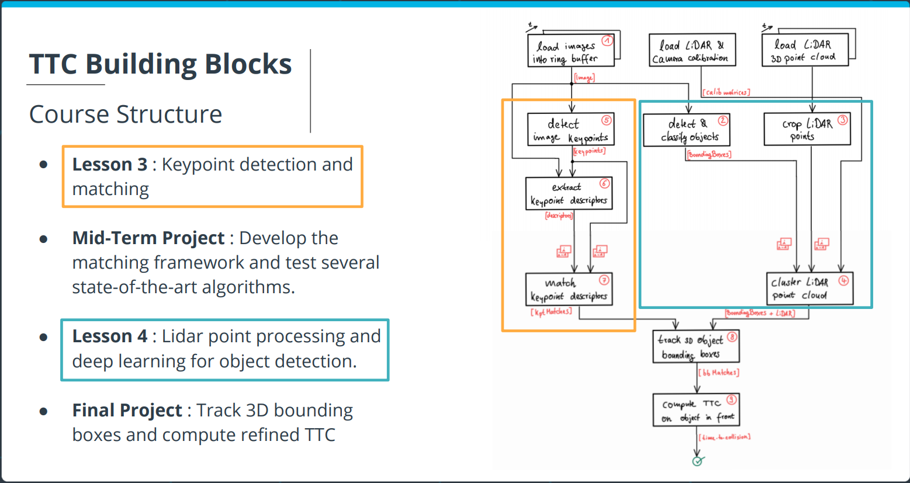

# SFND 3D Object Tracking

Welcome to the final project of the camera course. By completing all the lessons, you now have a solid understanding of keypoint detectors, descriptors, and methods to match them between successive images. Also, you know how to detect objects in an image using the YOLO deep-learning framework. And finally, you know how to associate regions in a camera image with Lidar points in 3D space. Let's take a look at our program schematic to see what we already have accomplished and what's still missing.



In this final project, you will implement the missing parts in the schematic. To do this, you will complete four major tasks: 
1. First, you will develop a way to match 3D objects over time by using keypoint correspondences. 
2. Second, you will compute the TTC based on Lidar measurements. 
3. You will then proceed to do the same using the camera, which requires to first associate keypoint matches to regions of interest and then to compute the TTC based on those matches. 
4. And lastly, you will conduct various tests with the framework. Your goal is to identify the most suitable detector/descriptor combination for TTC estimation and also to search for problems that can lead to faulty measurements by the camera or Lidar sensor. In the last course of this Nanodegree, you will learn about the Kalman filter, which is a great way to combine the two independent TTC measurements into an improved version which is much more reliable than a single sensor alone can be. But before we think about such things, let us focus on your final project in the camera course. 

## Dependencies for Running Locally
* cmake >= 2.8
  * All OSes: [click here for installation instructions](https://cmake.org/install/)
* make >= 4.1 (Linux, Mac), 3.81 (Windows)
  * Linux: make is installed by default on most Linux distros
  * Mac: [install Xcode command line tools to get make](https://developer.apple.com/xcode/features/)
  * Windows: [Click here for installation instructions](http://gnuwin32.sourceforge.net/packages/make.htm)
* Git LFS
  * Weight files are handled using [LFS](https://git-lfs.github.com/)
* OpenCV >= 4.1
  * This must be compiled from source using the `-D OPENCV_ENABLE_NONFREE=ON` cmake flag for testing the SIFT and SURF detectors.
  * The OpenCV 4.1.0 source code can be found [here](https://github.com/opencv/opencv/tree/4.1.0)
* gcc/g++ >= 5.4
  * Linux: gcc / g++ is installed by default on most Linux distros
  * Mac: same deal as make - [install Xcode command line tools](https://developer.apple.com/xcode/features/)
  * Windows: recommend using [MinGW](http://www.mingw.org/)

## Basic Build Instructions

1. Clone this repo.
2. Make a build directory in the top level project directory: `mkdir build && cd build`
3. Compile: `cmake .. && make`
4. Run it: `./3D_object_tracking`.

## Final Report

* FP.1 Match 3D Objects
  ```
  void matchBoundingBoxes(std::vector<cv::DMatch> &matches, std::map<int, int> &bbBestMatches, DataFrame &prevFrame, DataFrame &currFrame)
  {
    auto prevFrameBboxSize = prevFrame.boundingBoxes.size();
    auto currFrameBboxSize = currFrame.boundingBoxes.size();
    // All elements must be zero initialized for algorithm to work
    vector<vector<int>> countKeypointsInROIs(prevFrameBboxSize, vector<int> (currFrameBboxSize, 0));
    for (auto& matchingKeypoints: matches)
    {
        cv::KeyPoint queryKeyPoint = prevFrame.keypoints[matchingKeypoints.queryIdx];
        cv::Point queryPoint = cv::Point (queryKeyPoint.pt.x, queryKeyPoint.pt.y);
        bool queryPointFound = false;
        vector<int> queryBboxIdx;
        cv::KeyPoint trainKeyPoint = currFrame.keypoints[matchingKeypoints.trainIdx];
        cv::Point trainPoint = cv::Point (trainKeyPoint.pt.x, trainKeyPoint.pt.y);
        bool trainPointFound = false;
        vector<int> trainBboxIdx;

        for (std::size_t bbxidx = 0; bbxidx < prevFrameBboxSize; bbxidx++)
        {
            if (prevFrame.boundingBoxes[bbxidx].roi.contains(queryPoint))
            {
                queryPointFound = true;
                queryBboxIdx.push_back(bbxidx);
            }
        }

        for (std::size_t bbxidx = 0; bbxidx < currFrameBboxSize; bbxidx++)
        {
            if (currFrame.boundingBoxes[bbxidx].roi.contains(trainPoint))
            {
                trainPointFound = true;
                trainBboxIdx.push_back(bbxidx);
            }
        }

        if (queryPointFound && trainPointFound)
        {
            for (auto queryId: queryBboxIdx)
            {
                for (auto trainId: trainBboxIdx)
                {

                    countKeypointsInROIs[queryId][trainId] += 1; // prevFrame bbox enclosed keypoints in relation to current frame bbox enclosed keypoints
                }
            }
        }

    }
    // loop over external indexing for bounding box

    for (int i = 0; i < prevFrameBboxSize; i++)
    {
        int maxKeypointCount = 0;
        int maxCurrFrameId = 0;
        for (std::size_t j = 0; j < currFrameBboxSize; j++)
        {
            if (countKeypointsInROIs[i][j] > maxKeypointCount)
            {
                maxKeypointCount = countKeypointsInROIs[i][j];
                maxCurrFrameId = j;
            }
        }
        bbBestMatches[i] = maxCurrFrameId;

    }

  }
  ```

* FP.2 Compute Lidar-based TTC
  ```
  template<typename T>
  double computeMean(const std::vector<T>& numbers)
  {
    if (numbers.empty())
        return std::numeric_limits<double>::quiet_NaN();

    return std::accumulate(numbers.begin(), numbers.end(), 0.0) / numbers.size();
  }

  template<typename T, typename U>
  double computeVariance(const T mean, const std::vector<U>& numbers)
  {
    if (numbers.size() <= 1u)
        return std::numeric_limits<T>::quiet_NaN();

    auto const add_square = [mean](T sum, U i) {
        auto d = i - mean;
        return sum + d*d;
    };
    double total = std::accumulate(numbers.begin(), numbers.end(), 0.0, add_square);
    return total / (numbers.size() - 1);
  }


  void lidarPointInXDirection(vector<LidarPoint>& lidarPoints, vector<double>& lidarPointsInGivenDirection)
  {
      auto filterDirectionPoints = [&](const LidarPoint points){ lidarPointsInGivenDirection.push_back(points.x); };
      for_each(lidarPoints.begin(), lidarPoints.end(), filterDirectionPoints);
  }

  void computeTTCLidar(std::vector<LidarPoint> &lidarPointsPrev,
                     std::vector<LidarPoint> &lidarPointsCurr, double frameRate, double &TTC)
  {
    double laneWidth = 4.0; // assumed width of the ego lane

    vector<double> lidarPointsInDirectionX;
    lidarPointInXDirection(lidarPointsPrev, lidarPointsInDirectionX);
    auto meanLidarPointsPrev = computeMean<double>(lidarPointsInDirectionX);
    auto varianceLidarPointPrev = computeVariance(meanLidarPointsPrev, lidarPointsInDirectionX);
    auto stdDevPrev = sqrt(varianceLidarPointPrev);
    auto thresholdPrev = stdDevPrev * 2;
    auto lowerLimitPrev = meanLidarPointsPrev - thresholdPrev;
    auto upperLimitPrev = meanLidarPointsPrev + thresholdPrev;

    vector<double> lidarPointsInDirectionY;
    lidarPointInXDirection(lidarPointsCurr, lidarPointsInDirectionY);
    auto meanLidarPointsCurr = computeMean<double>(lidarPointsInDirectionY);
    auto varianceLidarPointCurr = computeVariance(meanLidarPointsCurr, lidarPointsInDirectionY);
    auto stdDevCurr = sqrt(varianceLidarPointCurr);
    auto thresholdCurr = stdDevCurr * 2;
    auto lowerLimitCurr = meanLidarPointsCurr - thresholdCurr;
    auto upperLimitCurr = meanLidarPointsCurr + thresholdCurr;

    vector<float> distPointsPrev;
    vector<float> distPointsCurr;
    // find closest distance to Lidar points within ego lane

    for (auto it = lidarPointsPrev.begin(); it != lidarPointsPrev.end(); ++it)
    {
        if (abs(it->y) <= laneWidth / 2 and it->x > lowerLimitPrev and it->x < upperLimitPrev)
        {
            distPointsPrev.push_back(it->x);
        }
    }

    for (auto it = lidarPointsCurr.begin(); it != lidarPointsCurr.end(); ++it)
    {
        if (abs(it->y) <= laneWidth / 2 and it->x > lowerLimitCurr and it->x < upperLimitCurr)
        {
            distPointsCurr.push_back(it->x);
        }
    }
    auto minXPrev = min_element(distPointsPrev.begin(), distPointsPrev.end());
    auto minXCurr = min_element(distPointsCurr.begin(), distPointsCurr.end());
    cout << "size of lidarPointsPrev : " << lidarPointsPrev.size() << " size of distPointsPrev : " << distPointsPrev.size() << endl;
    cout << "size of lidarPointsCurr : " << lidarPointsCurr.size() << " size of distPointsCurr : " << distPointsCurr.size() << endl;
    // compute TTC from both measurements
    double dT = 1 / frameRate;
    TTC = *minXCurr * dT / (*minXPrev - *minXCurr);

}
  ```

* FP.3 Associate Keypoint Correspondences with Bounding Boxes
  ```
  void clusterKptMatchesWithROI(BoundingBox &boundingBoxCurr, BoundingBox &boundingBoxPrev, std::vector<cv::KeyPoint> &kptsPrev, std::vector<cv::KeyPoint> &kptsCurr, std::vector<cv::DMatch> &kptMatches)
  {
    // Shrink Curr and Prev Bounding Boxes
    vector<cv::DMatch> kptsMatchesInROI;
    cv::Rect shrinkBoundBoxCurr, shrinkBoundingBoxPrev;
    const float shrinkFactor = 0.10;
    shrinkBoundBoxCurr.x = boundingBoxCurr.roi.x + shrinkFactor * boundingBoxCurr.roi.width / 2.0;
    shrinkBoundBoxCurr.y = boundingBoxCurr.roi.y + shrinkFactor * boundingBoxCurr.roi.height / 2.0;
    shrinkBoundBoxCurr.width = boundingBoxCurr.roi.width * (1 - shrinkFactor);
    shrinkBoundBoxCurr.height = boundingBoxCurr.roi.height * (1 - shrinkFactor);

    shrinkBoundingBoxPrev.x = boundingBoxPrev.roi.x + shrinkFactor * boundingBoxPrev.roi.width / 2.0;
    shrinkBoundingBoxPrev.y = boundingBoxPrev.roi.y + shrinkFactor * boundingBoxPrev.roi.height / 2.0;
    shrinkBoundingBoxPrev.width = boundingBoxPrev.roi.width * (1 - shrinkFactor);
    shrinkBoundingBoxPrev.height = boundingBoxPrev.roi.height * (1 - shrinkFactor);

    // Check if keypoints from Curr and Prev frames belong to shrink bounding boxes if yes then add kptsMatchesInROI
    for (const auto& kpts: kptMatches)
    {
        auto prevFrameKpt = kptsPrev[kpts.queryIdx];
        auto kptInPrevFrame = cv::Point (prevFrameKpt.pt.x, prevFrameKpt.pt.y);
        auto currFrameKpt = kptsCurr[kpts.trainIdx];
        auto kptInCurrFrame = cv::Point (currFrameKpt.pt.x, currFrameKpt.pt.y);


        if(shrinkBoundBoxCurr.contains(kptInCurrFrame) and shrinkBoundingBoxPrev.contains(kptInPrevFrame))
        {

            kptsMatchesInROI.push_back(kpts);
        }

    }

    // Calculate mean from Curr and Prev keypoints in ROI
    double meanDistance{0.0};
    for (const auto& kptInROI: kptsMatchesInROI)
        meanDistance += cv::norm(kptsCurr[kptInROI.trainIdx].pt - kptsPrev[kptInROI.queryIdx].pt);
    meanDistance = meanDistance / kptsMatchesInROI.size();

    if (kptsMatchesInROI.empty())
        cerr << "Invalid Keypoitns size detected in function clusterKptMatchesWithROI "<<endl;

    // Check the similarity of keypoints by comparing keypoints distance from curr to prev frames with distance threshold scaled by 1.5x
    double kptsAcceptanceThreshold = meanDistance * 1.8;
    for (const auto& kptInROI: kptsMatchesInROI)
    {
        double similarityKptsDistance = cv::norm(kptsCurr[kptInROI.trainIdx].pt - kptsPrev[kptInROI.queryIdx].pt);
        if(similarityKptsDistance < kptsAcceptanceThreshold)
            boundingBoxCurr.kptMatches.push_back(kptInROI);
    }
}
  ```
* FP.4 Compute Camera-based TTC
 ```
 void computeTTCCamera(std::vector<cv::KeyPoint> &kptsPrev, std::vector<cv::KeyPoint> &kptsCurr, 
                      std::vector<cv::DMatch> kptMatches, double frameRate, double &TTC, cv::Mat *visImg)
{
    // compute distance ratios between all matched keypoints
    vector<double> distRatios; // stores the distance ratios for all keypoints between curr. and prev. frame
    for (auto it1 = kptMatches.begin(); it1 != kptMatches.end() - 1; ++it1)
    { // outer keypoint loop

        // get current keypoint and its matched partner in the prev. frame
        cv::KeyPoint kpOuterCurr = kptsCurr.at(it1->trainIdx);  //ref
        cv::KeyPoint kpOuterPrev = kptsPrev.at(it1->queryIdx); //source

        for (auto it2 = kptMatches.begin() + 1; it2 != kptMatches.end(); ++it2)
        { // inner keypoint loop

            double minDist = 100.0; // min. required distance

            // get next keypoint and its matched partner in the prev. frame
            cv::KeyPoint kpInnerCurr = kptsCurr.at(it2->trainIdx);
            cv::KeyPoint kpInnerPrev = kptsPrev.at(it2->queryIdx);

            // compute distances and distance ratios
            double distCurr = cv::norm(kpOuterCurr.pt - kpInnerCurr.pt);
            double distPrev = cv::norm(kpOuterPrev.pt - kpInnerPrev.pt);

            if (distPrev > std::numeric_limits<double>::epsilon() && distCurr >= minDist)
            { // avoid division by zero

                double distRatio = distCurr / distPrev;
                distRatios.push_back(distRatio);
            }
        } // eof inner loop over all matched kpts
    }     // eof outer loop over all matched kpts

    // only continue if list of distance ratios is not empty
    if (distRatios.size() == 0)
    {
        TTC = NAN;
        return;
    }

    // compute camera-based TTC from distance ratios
//    double meanDistRatio = std::accumulate(distRatios.begin(), distRatios.end(), 0.0) / distRatios.size();
    std::sort(distRatios.begin(), distRatios.end());
    long medIndex = floor(distRatios.size() / 2.0);
    double medianDistRatio = distRatios.size() % 2 == 0 ? (distRatios[medIndex - 1] + distRatios[medIndex]) / 2.0 : distRatios[medIndex];

    double dT = 1 / frameRate;
    TTC = -dT / (1 - medianDistRatio);

}
 ```

* FP.5 Performance Evaluation 1
  * Given : Find examples where the TTC estimate of the Lidar sensor does not seem plausible. Describe your observations and provide a sound argumentation why you think this happened (Several examples (2-3) have been identified and described in detail. The assertion that the TTC is off has been based on manually estimating the distance to the rear of the preceding vehicle from a top view perspective of the Lidar points). 
 
  * Solution : As observed from the top view frames (based on index 1 frame 1) and can be seen in the tables from FP.6 that frames 6, 7 and 8 are identified as one the case where TTC Lidar measurements are inaccurate. One possible explanation is between frames 6 and 7 the distance to the preceeding car reduces signficantly more then previous frames which 0.06m. And from frame 7 to 8 the distance change drops down 0.03m. It is due to very small change in distance erroneous measurements are observed. It can be that scene refers to stopping of vehicles scenario due to red signal where deaccelration can cause constant velocity model to be voilated. NOTE: Please refer to NOTE in FP.6 for more information.
  
* FP.6 Performance Evaluation 2
  * Given : Run several detector / descriptor combinations and look at the differences in TTC estimation. Find out which methods perform best and also include several examples where camera-based TTC estimation is way off. As with Lidar, describe your observations again and also look into potential reasons (All detector / descriptor combinations implemented in previous chapters have been compared with regard to the TTC estimate on a frame-by-frame basis. To facilitate comparison, a spreadsheet and graph should be used to represent the different TTCs).
  
  * Solution : By varying shrinking factor to enclosed lidarpoints and varying similarity acceptance threshold for keypoints in ROI(see function clusterKptMatchesWithROI) the following results are obtained, for the given task two combination of the above two mentioned parameters are used:
  * shrinkingFactor = 0.10 and kptsAcceptanceThreshold = meanDistance * 1.8

|TTC\_Lidar|TTC\_Camera ( DetectorType = SHITOMASI, DescriptorType = BRISK)|TTC\_Camera(DetectorType = SIFT, DescriptorType = SIFT)|TTC\_Camera(DetectorType = SHITOMASI, DescriptorType = SIFT)|
|----------|---------------------------------------------------------------|-------------------------------------------------------|------------------------------------------------------------|
|12.9722   |12.943                                                         |13.3717                                                |13.0639                                                     |
|12.264    |12.3445                                                        |14.78                                                  |12.6201                                                     |
|13.9161   |13.4079                                                        |13.1739                                                |18.3804                                                     |
|14.8865   |12.561                                                         |18.1978                                                |12.9209                                                     |
|12.1873   |12.5574                                                        |14.7723                                                |13.0927                                                     |
|7.50199   |33.8072                                                        |10.6541                                                |51.093                                                      |
|34.3404   |11.1653                                                        |14.8154                                                |11.6118                                                     |
|18.7875   |49.0952                                                        |15.0608                                                |34.5924                                                     |
|15.8894   |11.2653                                                        |14.3484                                                |11.2653                                                     |
|13.7297   |12.5101                                                        |11.6912                                                |13.1205                                                     |
|10.4914   |11.1985                                                        |12.1314                                                |11.2358                                                     |
|10.1      |12.0958                                                        |11.8249                                                |11.9654                                                     |
|9.22307   |11.1144                                                        |10.4493                                                |10.9561                                                     |
|10.9678   |11.7236                                                        |9.67416                                                |12.0086                                                     |
|8.09422   |9.65331                                                        |10.4679                                                |10.6921                                                     |
|8.81392   |11.6681                                                        |9.18657                                                |11.7852                                                     |
|10.2926   |12.6356                                                        |8.68017                                                |11.4487                                                     |
|8.30978   |11.961                                                         |9.48347                                                |10.3618                                                     |

  * shrinkingFactor = 0.20 and kptsAcceptanceThreshold = meanDistance * 1.8
  
|TTC\_Lidar|TTC\_Camera(DetectorType = SHITOMASI, DescriptorType = BRISK)|TTC\_Camera(DetectorType = AKAZE, DescriptorType = AKAZE)|TTC\_Camera(DetectorType = BRISK, DescriptorType = SIFT)|
|----------|-------------------------------------------------------------|---------------------------------------------------------|--------------------------------------------------------|
|12.9722   |12.943                                                       |13.4909                                                  |13.2591                                                 |
|12.264    |12.3445                                                      |18.5575                                                  |17.6931                                                 |
|13.9161   |13.4079                                                      |13.5769                                                  |13.8436                                                 |
|15.804    |12.561                                                       |16.3527                                                  |13.6821                                                 |
|12.5951   |12.5574                                                      |16.1885                                                  |25.2317                                                 |
|8.25109   |33.8072                                                      |15.843                                                   |13.6074                                                 |
|20.986    |11.1653                                                      |18.8779                                                  |10.5954                                                 |
|18.7875   |49.0952                                                      |15.4278                                                  |17.4675                                                 |
|15.8894   |11.2653                                                      |17.8539                                                  |12.8478                                                 |
|13.7297   |12.5101                                                      |15.2153                                                  |12.498                                                  |
|10.4914   |11.1985                                                      |12.9482                                                  |14.8705                                                 |
|10.1      |12.0958                                                      |11.9297                                                  |11.3843                                                 |
|9.22307   |11.1144                                                      |10.2777                                                  |10.5229                                                 |
|10.9678   |11.7236                                                      |12.1806                                                  |15.4615                                                 |
|8.09422   |9.65331                                                      |10.2424                                                  |11.6222                                                 |
|8.81392   |11.6681                                                      |10.8375                                                  |10.8068                                                 |
|10.2926   |12.6356                                                      |9.36522                                                  |10.6041                                                 |
|8.30978   |11.961                                                       |8.9849                                                   |12.6701                                                 |

  * TTC Camera can been to way off in frames 6,7 and 8 when detector type is SHITOMASI and descriptor type is BRISK for the both shrinkfactor combination as stated above. One possible explanation is between frames 6 and 7 the distance to the preceeding car reduces signficantly more then previous frames which 0.06m. And from frame 7 to 8 the distance change drops down 0.03m. It is due to very small change in distance and some keypoints that are mismatched one can see that SHITOMASI-BRISK detector-descriptor combo is showing erroneous measurement. Although detector-descriptor combination for AKAZE-AKAZE and BRISK-SIFT is showing stable measurement for frames 6 and 7 but for the 8th frame they also indicate a small delta in distance is causing TTC measurement to be erroneous. NOTE: All the measurement as can be seen in the table are taken after the problematic combination of shrinkingFactor = 0.10 and kptsAcceptanceThreshold = meanDistance * 1.5 has been improved as not to include outlier lidarpoints from the vehicles beyond the preceeding vehicle. Moreover, improving the shrinkfactor and simulatenously increasing the kptsAcceptanceThreshold to accomdate more keypoints matches has improved the TTC Camera measurement. Nonetheless, it was all obvserved manually and proper statistical model is required to correct TTC from camera and lidar sensors.